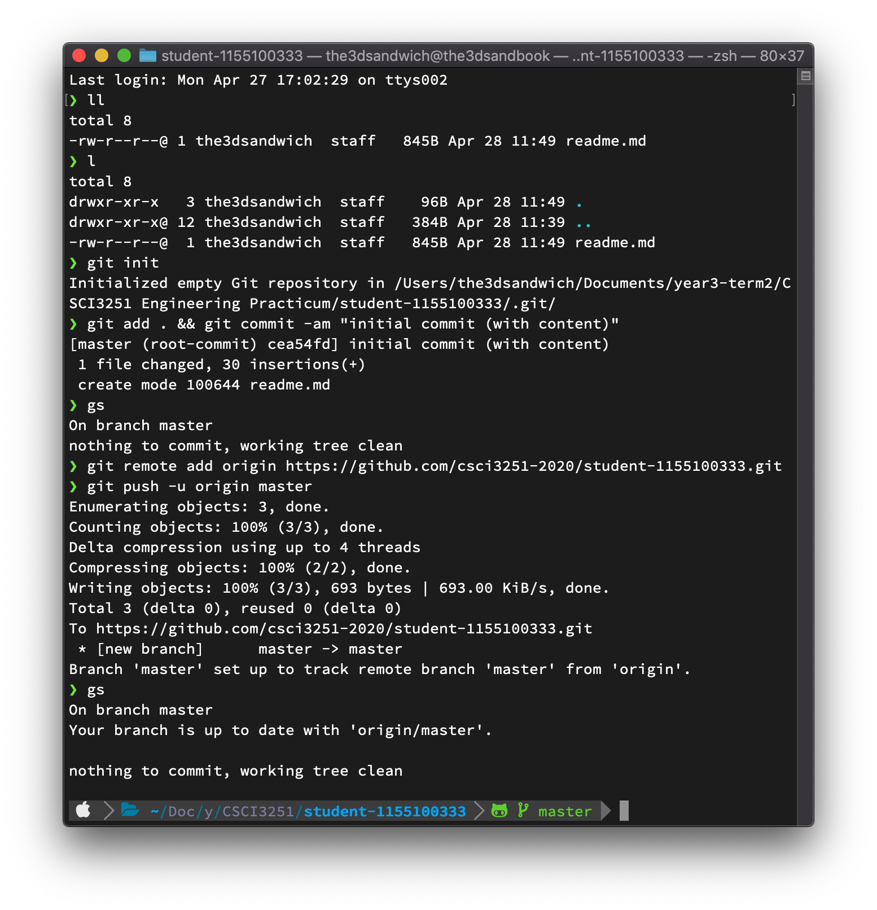

## Project Milestone #2 

_1155100333_

Hi! My name is **Shann Wei YEH**, a Computer Science student in my third year.

I know. I'm in the older section in this course.

I need a task list. Ok here goes. I've so far

- [x] finished workshop 1
- [x] finished workshop 2
- [x] finished workshop 3
- [ ] haven't started on reflection report unfortunately

Some more facts about me:

| item         | description       |
| ------------ | ----------------- |
| name         | weiwei            |
| year         | 3                 |
| github repos | 33 (I spam a lot) |

some notable repositories:

* [Dubby - an event based socializing platform](https://github.com/the3dsandwich/csci3100-grp31)
* [Project milestone #1](https://github.com/the3dsandwich/github-slideshow)
* [DD- Text](https://github.com/the3dsandwich/dd-text)

That's it! Thanks guyz

